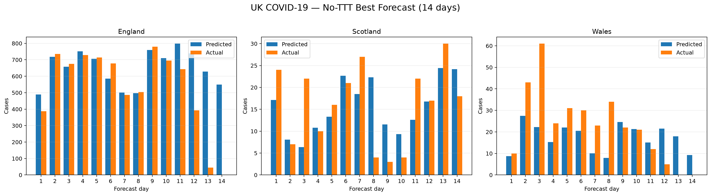
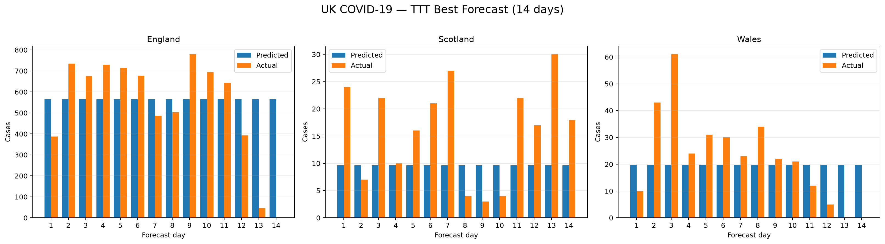
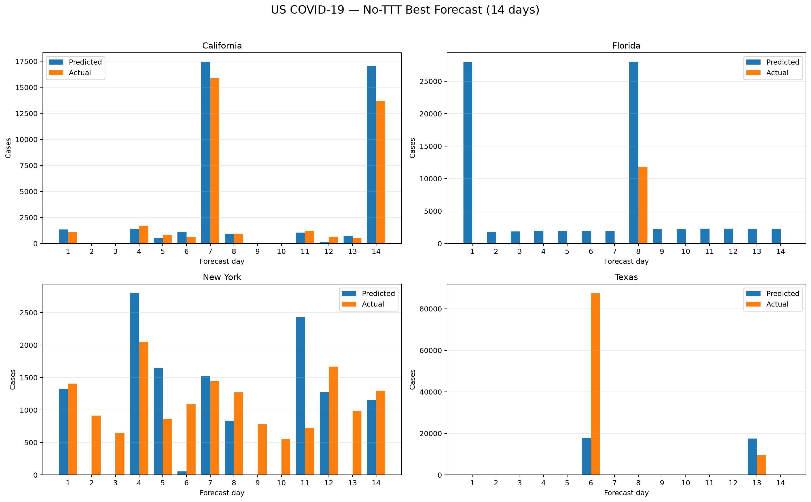
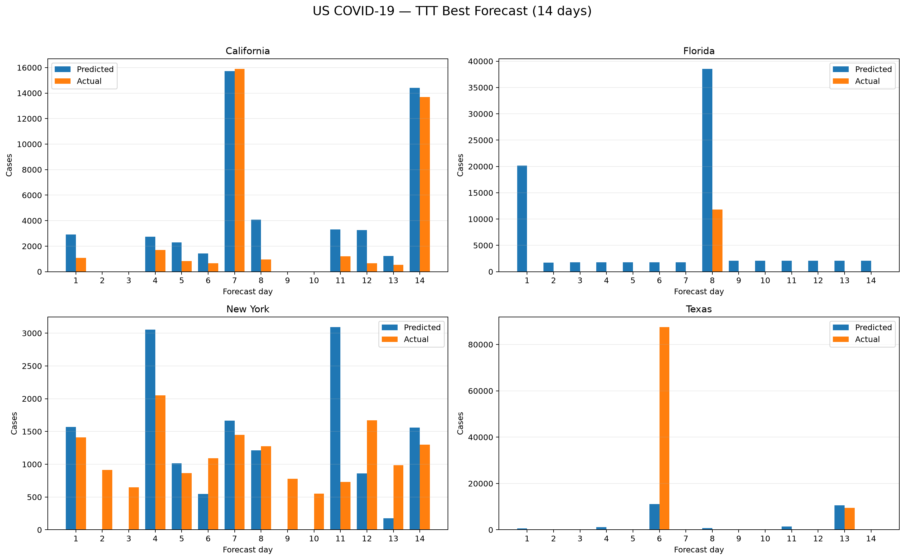
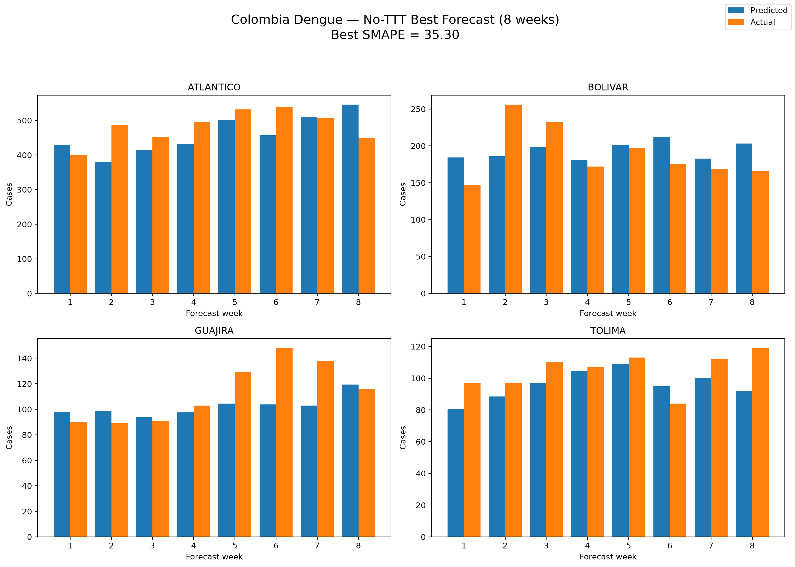
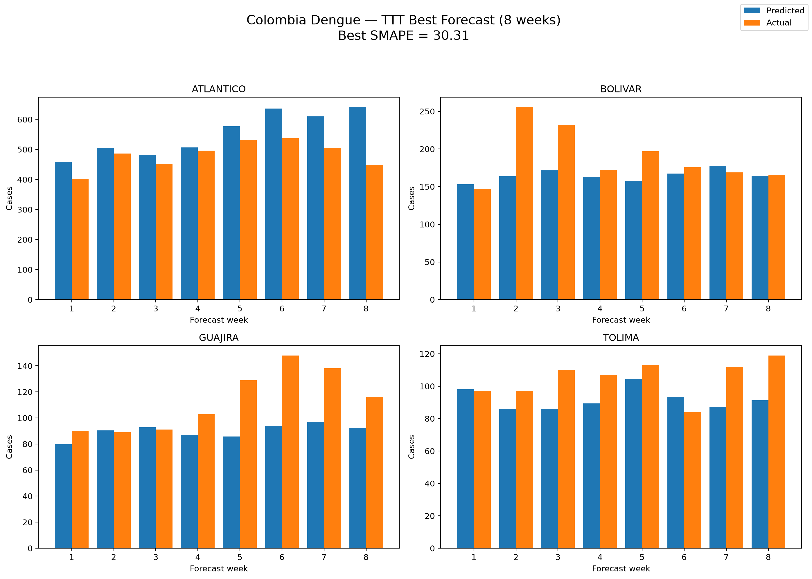
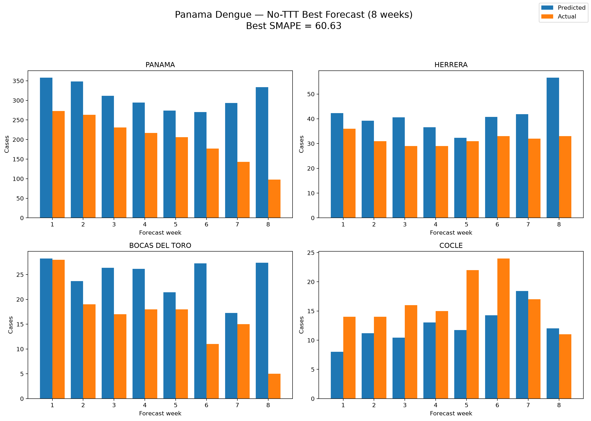
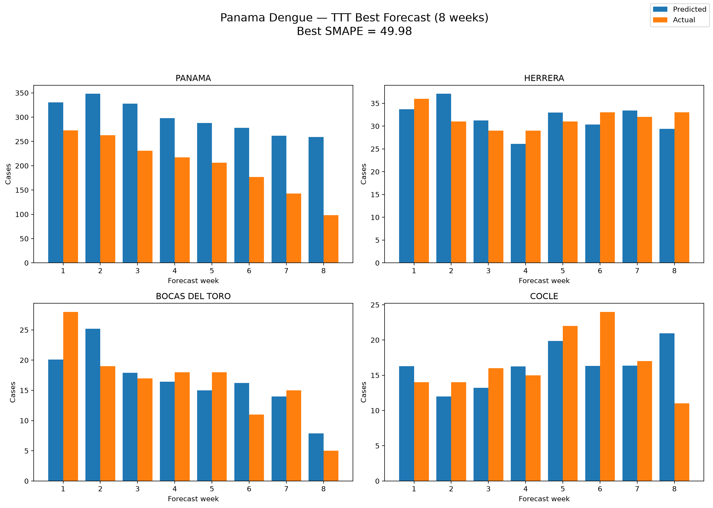

# Epidemic Forecasting with LLM and Test-Time Training

This project investigates the use of large language models (LLMs) and test-time training (TTT) for epidemic forecasting.

The current experiments focus on **14-day COVID-19 forecasting** for the UK and US using **Qwen2.5-Coder-7B-Instruct**.

Two settings are compared:

- **No-TTT:** 100 independent code generations.
- **TTT:** 10 steps × 10 rollouts = 100 generated candidates.

Generated forecasting code is evaluated primarily using **SMAPE**, where lower values indicate better forecasting performance.

---

## COVID-19 Results

| Dataset | Method | Best SMAPE (lower is better) | Valid Candidates | Distinct Valid |
|---|---|---:|---:|---:|
| UK | No-TTT | **39.48** | 51 / 100 | 22 |
| UK | TTT | 46.95 | **63 / 100** | **29** |
| UK | TimesFM | 95.42 | N/A | N/A |
| US | No-TTT | **54.91** | 49 / 100 | **23** |
| US | TTT | 55.84 | **70 / 100** | 14 |
| US | TimesFM | 151.86 | N/A | N/A |

TTT produced more valid candidates on both datasets, although the best SMAPE was achieved by No-TTT for both the UK and US experiments.

TimesFM was reproduced locally using the EpiCastBench implementation. The reproduced SMAPE values were **95.420 for the UK** and **151.861 for the US**, matching the published EpiCastBench results.

---

## UK 14-Day Forecasts

The UK dataset contains four regional time series: **England, Northern Ireland, Scotland and Wales**.

Each figure compares the predicted number of cases with the true held-out observations over the 14-day forecasting period.

### No-TTT

The best UK No-TTT candidate achieved a SMAPE of **39.48**.



### TTT

The best UK TTT candidate achieved a SMAPE of **46.95**.



The figures provide a direct view of the daily forecasting behaviour and make it possible to compare the predicted epidemic trajectory with the real observations.

---

## US 14-Day Forecasts

The US dataset contains 56 regional time series. To keep the visualisation readable, four representative regions are shown: **California, Florida, New York and Texas**.

### No-TTT

The best US No-TTT candidate achieved a SMAPE of **54.91**.



### TTT

The best US TTT candidate achieved a SMAPE of **55.84**.



The US dataset contains many zero observations and occasional large reporting spikes, making accurate day-by-day forecasting particularly challenging.

---

## Saved COVID-19 Results

The final 100-candidate results are stored in:

```text
results/covid19/final_100/
├── uk_no_ttt/
├── uk_ttt/
├── us_no_ttt/
└── us_ttt/
```

Each experiment folder contains the generated forecasting code and evaluation results.

Important files include:

- `aggregate_results.json` — overall experiment statistics
- `best_generated_candidate.py` — best generated forecasting code
- `best_forecast_vs_actual.csv` — predicted and actual values for each forecast day
- `best_series_metrics.csv` — evaluation results for individual time series
- `top10_by_smape.csv` — top distinct candidates ranked by SMAPE
- `top10_by_reward.csv` — top candidates ranked by optimisation reward

---

## EpiCastBench TimesFM Baseline

TimesFM was reproduced locally using the same COVID-19 datasets and 14-day forecasting horizon used by EpiCastBench.

| Dataset | Reproduced TimesFM SMAPE (lower is better) |
|---|---:|
| UK | 95.420 |
| US | 151.861 |

The reproduced values match the EpiCastBench benchmark results.

To verify that the comparison uses the same primary metric, the saved TimesFM predictions were also evaluated using the COVID-19 evaluator in this repository.

The SMAPE results were numerically identical:

- UK: `95.420262968339`
- US: `151.860921300020`

This confirms that the TimesFM and LLM-generated forecasting results use an equivalent SMAPE calculation.

The reproduction scripts and saved results are available in:

`epidemic_forecasting/baselines/timesfm/`

---

## Dengue Forecasting

The next epidemic forecasting task will extend the same framework to dengue data.

### Results

Results will be added here after the dengue experiments are completed.

### Forecast Visualisation

Forecast visualisations will be added here after the dengue experiments are completed.

---

## Dengue Results

Two Dengue datasets were evaluated using an 8-week forecasting horizon: Colombia and Panama.

### Summary Table

| Dataset | Method | Best SMAPE | Valid Candidates | Distinct Valid |
|---|---|---:|---:|---:|
| Colombia | No-TTT | 35.30 | 36 / 100 | 23 |
| Colombia | TTT | 30.31 | 62 / 100 | 14 |
| Colombia | TimesFM | **30.03** | N/A | N/A |
| Panama | No-TTT | 60.63 | 56 / 100 | 30 |
| Panama | TTT | **49.98** | 72 / 100 | 13 |
| Panama | TimesFM | 70.82 | N/A | N/A |

TTT achieved a lower best SMAPE than No-TTT on both Dengue datasets and also produced more valid candidates.

For Colombia, the reproduced TimesFM baseline achieved the lowest SMAPE overall (30.03), closely followed by TTT (30.31). For Panama, TTT achieved the lowest SMAPE (49.98), outperforming both No-TTT (60.63) and TimesFM (70.82).


### Forecast Comparison Figures

#### Colombia — No-TTT Best Forecast


This figure shows the best 8-week forecast from the No-TTT baseline on the Colombia dataset.

#### Colombia — TTT Best Forecast


This figure shows the best 8-week forecast found by TTT on the Colombia dataset.

#### Panama — No-TTT Best Forecast


This figure shows the best 8-week forecast from the No-TTT baseline on the Panama dataset.

#### Panama — TTT Best Forecast


This figure shows the best 8-week forecast found by TTT on the Panama dataset.

### Saved Dengue Results

The final results are stored in:

- `epidemic_forecasting/results/dengue/colombia_8weeks/colombia_no_ttt_7b_100/job_6017915/`
- `epidemic_forecasting/results/dengue/colombia_8weeks/colombia_ttt_7b_100/job_6017916/`
- `epidemic_forecasting/results/dengue/panama_8weeks/panama_no_ttt_7b_100/job_6017917/`
- `epidemic_forecasting/results/dengue/panama_8weeks/panama_ttt_7b_100/job_6017918/`

### EpiCastBench TimesFM Baseline

TimesFM was reproduced locally using the EpiCastBench implementation with the same 8-week forecasting horizon.

| Dataset | Reproduced TimesFM SMAPE |
|---|---:|
| Colombia | 30.031 |
| Panama | 70.822 |

The reproduced values match the published EpiCastBench results.

Reproduction scripts and saved predictions are stored in:

`epidemic_forecasting/baselines/timesfm/`
